- [UC 3.0 管理平台使用手册](#start)
    - [1 前言](#intro)
        - [1.1 浏览器支持范围](#supported-browsers)
    - [2 管理员登录](#admin-login)
        - [2.1 初始化](#init-setup)
            - [2.1.1 配置用户中心名称](#init-uc-name)
            - [2.1.2 配置必填属性](#init-mandatory-attrs)
            - [2.1.3 配置扩展属性](#init-ext-attrs)
            - [2.1.4 基本设置](#init-basic)
            - [2.1.5 邮件短信设置](#init-smtp-sms)
        - [2.2用户管理](#user-mgr)
            - [2.2.1 界面说明](#user-mgr-ui)
            - [2.2.2 用户操作](#user-mgr-action)
            - [2.2.3 添加用户](#user-mgr-create)
        - [2.3 组织机构](#org-mgr)
            - [2.3.1界面说明](#org-mgr-ui)
        - [2.4扩展属性](#ext-attrs-mgr)
            - [2.4.1界面说明](#ext-attrs-mgr-ui)
        - [2.5 连接器](#connector-mgr)
            - [2.5.1 添加连接器](#connector-mgr-create)
            - [2.5.2 链接器同步和AD/LDAP导入用户的区别](#connector-mgr-ad-ldap-diff)
        - [2.6 设置](#policy-mgr)
            - [2.6.1 基本设置](#policy-basic)
                - [2.6.2 邮件服务配置](#policy-basic-smtp)
                - [2.6.3 短信网关设置](#policy-basic-sms-gw)
        - [2.7消息模板](#template-mgr)
            - [2.7.1 邮件邀请模板](#template-mgr-welcome)
            - [2.7.2 邮箱验证模板](#template-mgr-email-verification)
            - [2.7.3 密码重置模板](#template-mgr-reset-pwd)
            - [2.7.4 短信模板](#template-mgr-mobile-verification)

# UC 3.0 管理平台使用手册
## <a name="intro"/>1 前言
用户中心为企业提供了统一的用户管理与身份认证服务。用户中心管理平台为管理员提供了用户管理，用户属性管理，用户组织结构管理，密码复杂度等策略配置。管理员可以通过设置链接器同步企业AD/LDAP中的帐号。同时，普通用户也可以登录管理平台查看自己的用户属性。

### <a name="supported-browsers"/>1.1 浏览器支持范围
- Internet Explorer 11
- Chrome 43 

## 2 管理员登录
管理平台采用WEB方式，允许两种帐号登录，一种是
- **管理员**帐号登录，
- 一种是自服务**普通用户**登录，登录后呈现的页面有差别。

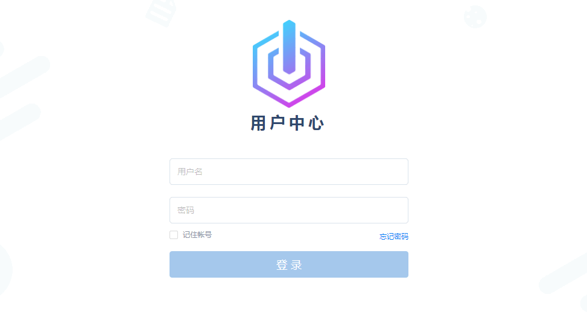

### 2.1 初始化
UC首次使用会提示管理员对用户中心做初始化配置。

#### 2.1.1 配置用户中心名称
用户中心名称为用户中心控制台的名称，用户中心创建后可再次编辑。

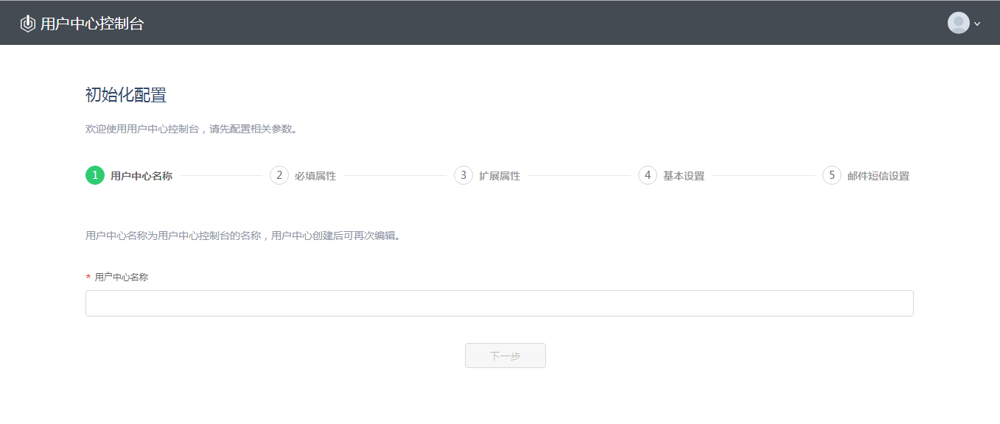

配置完成用户中心名称，单击"下一步"进入配置必填属性页。
#### 2.1.2 配置必填属性
用户中心为用户预定义了 n 个常用基本属性，包括
- **用户名**
- **密码**
- **邮箱**
- **性别**
- **手机**
- **姓名**
- **昵称**
- **头像** 
- **组织结构**

管理员在首次初始化用户中心时，可以指定**必填属性**及系统的**登录属性**。

**必填属性**：用户必填属性是在创建用户帐号时必须提供的用户信息。用户名作为用户帐号在UC 中的唯一标识，默认设置为必填属性。用户密码也默认设置为必填属性。系统建议管理员把“邮箱”设置为必填属性，以便找回用户帐号的密码。

**登录属性**：登录属性是可以标识用户唯一性，用来登录的用户属性。系统默认使用用户名作为登录属性。管理员也可以把“邮箱”，“手机”设置为登录属性，这样用户可以通过邮箱或手机作为唯一标识，提交身份认证。

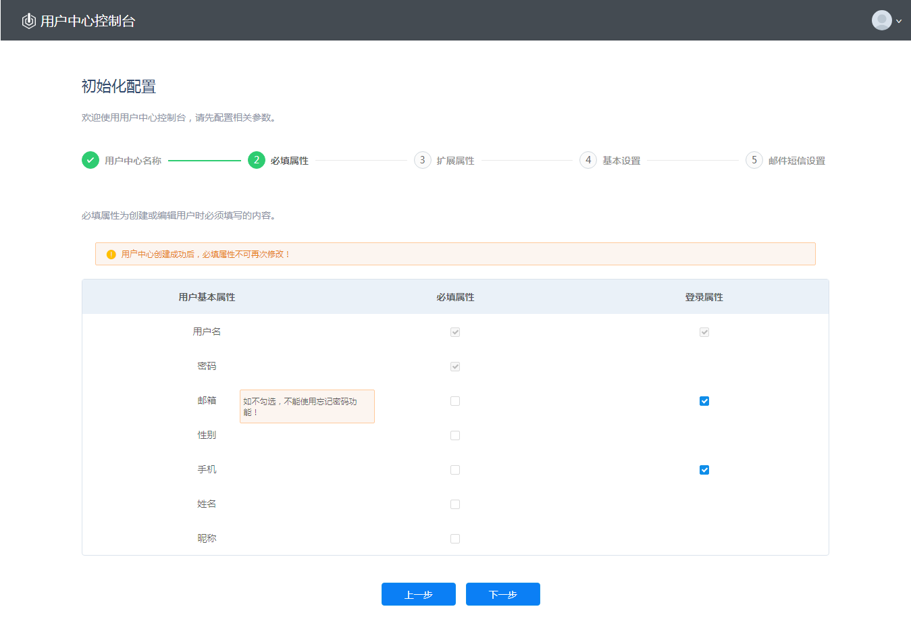

- 用户名、密码默认勾选，且不可编辑。用户名是用户中心识别用户唯一性的默认属性。用户创建后，用户名不能改变。用户名不能是邮箱格式，手机格式（全数字） 。

- 邮箱默认勾选，可再次编辑。不勾选邮箱出现提示：如不勾选，不能使用忘记密码功能。

- 登录属性：用户名默认勾选，且不可编辑。邮箱和手机为可选项，初始化完成后可编辑。邮箱／手机，作为用户登录属性，用户必须验证邮箱／手机后，可以通过提供用邮箱或手机来登录，并标识身份；邮箱／手机作为用户登录属性， 用户创建成功后，邮箱／手机可以改变，每次改变后都需要验证后才可以作为登录属性，用户名不能改变。

单击"上一步"，可查看上一项配置内容。 单击"下一步"，进入配置扩展属性页。

#### 2.1.3 配置扩展属性
为了适应不同应用程序的要求，用户可添加自定义属性，最多可以创建 20 个扩展属性。扩展属性创建后不可删除。

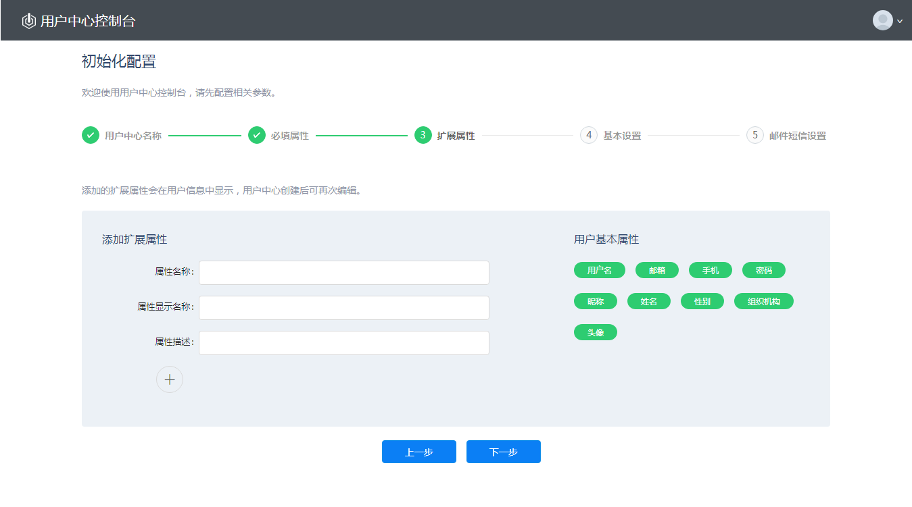

- **属性名称**  该项为必填项，作为扩展属性在系统中的唯一标识。可输入字母、数字，但不能以数字开头， 字符长度为2至20个。创建后不可以编辑，属性值唯一。

- **属性显示名称** 该项为必填项, 只可填写大小写英文字母、数字、汉字, 字符长度为2至20个，创建后可以编辑，属性值唯一。

- **属性描述** 文本编辑，创建后可编辑，可以容纳256个字符。

单击"上一步"，可查看上一项配置内容。
单击"下一步"，进入配置基本设置页。

#### 2.1.4 基本设置
通过用户中心的设置选项，可设置是否准许用户自注册及系统密码策略。

- 允许用户自注册，开启此选项后新用户可以通过管理平台登录页面创建帐号。如果不开启此选项，只有管理员才能创建新用户。

- 密码策略，创建或注册用户时，密码格式与需要符合密码策略要求。
  1. 密码复杂度：管理员通过配置密码复杂度来限定所有用户密码格式，必须包含数字，大写字母，小写字母，特殊字符，密码最短长度。
  2. 密码有效期：密码的有效时间范围。密码过期后，用户不能使用原密码登录。系统 在密码过期 前7 天，开始提示用户： 用户自服务登录后，顶部状态提示 密码即将过期，请及时更换您的密码。调用 身份认证API 也应该返回相应错误。如果用户密码过期，用户可以通过找回密码逻辑找回密码。如果管理员可以重置用户密码，也可以通过管理员重置密码。
  3. 强制密码历史：确保旧的密码不会被重新使用。
  4. 管理员修改密码：是否准许管理员修改普通用户密码。如果开启，管理员可以帮助忘记密码的用户重置密码。  考虑到安全性，如果开启此选项，建议同时开启“首次登陆修改密码”。如果不开启，管理员不能修改用户密码，忘记密码的用户可以通过“忘记密码”流程找回密码。

单击"上一步"，可查看上一项配置内容。 单击"下一步"，进入邮件短信设置页。

#### 2.1.5 邮件短信设置
通过用户中心的设置选项，可设置系统的邮件服务器及短信网关配置。

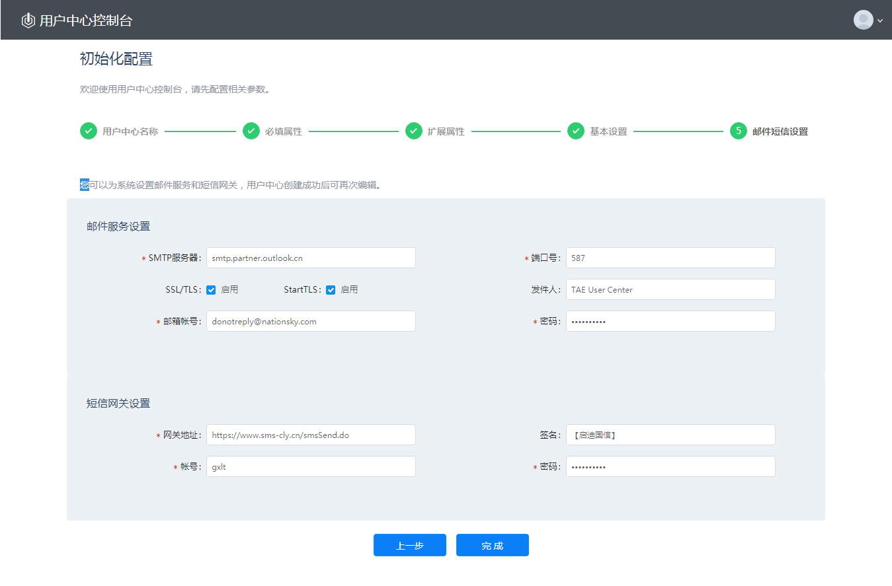

【邮件服务设置】用户中心通过配置好的邮件服务发送注册邀请，密码找回等信息。

【短信网关设置】用户中心也可以通过短信方式发送用户注册信息，密码找回等信息。

单击"上一步"，可查看上一项配置内容。 单击"完成"初始化完成后，进入用户中心控制台首页。

初始化完成，会自动弹出为管理员设置邮箱页面，若不设置将不能对管理员进行【忘记密码】操作。

### 2.2用户管理
管理员可以通过管理平台创建、更新和删除用户，同时通过文件模版或配置AD/LDAP服务可以批量导入用户。

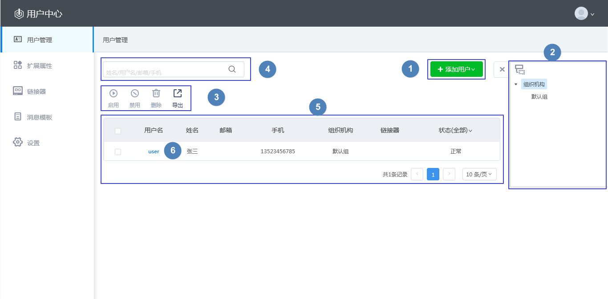
#### 2.2.1界面说明

1. 添加用户： 可手动添加，通过文件导入csv格式文件用户，可批量导入AD/LDAP服务中用户。
2.	组织机构：单击向左展开以树结构显示。可单击组织机构名称筛选出该组织及其子组中的用户。
3.	操作按钮：启用，禁用，删除，导出
4.	搜索：可通过用户名，姓名，邮箱，手机快速查找用户。最少需输入2个字符。模糊搜索、组织筛选和状态筛选结果取交集。
5.	用户列表： 显示用户基本信息及用户状态，可根据用户状态对用户进行筛选。
6.	用户名：单击可进入该用户详情页。
7.	链接器： 如果用户是从AD/LDAP同步到UC,用户信息会显示连接器名称，以表明用户归属性。如果用户是由管理员创建，文件导入或AD/LDAP导入，此用户链接器名称为空，表明用户不属于任何链接器。

#### 2.2.2用户操作
    
  **启用** 对禁用用户进行启用操作，仅针对禁用用户，支持批量启用。

  **禁用** 对启用用户进行禁用操作，仅针对启用用户，支持批量禁用。用户被禁用后不可登录自服务。
    
  **删除** 对用户进行删除操作，支持批量删除。

  **导出** 可将用户导出为csv格式文件，支持导出搜索或筛选后的用户。导出文件可再次导入系统（除管理员用户以外）。

#### 2.2.3 添加用户
用户中心提供三种添加用户的方式：文件导入，AD/LDAP导入，手动添加。通过这三种方式添加的用户均归属于用户中心。
单击"添加用户"显示下拉菜单，如下图：

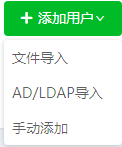

【文件导入】 可批量导入用户，单次最多导入5000条。

【AD/LDAP导入】  可导入AD/LDAP 服务中的用户，导入后用户归属于UC。

【手动添加】 添加用户页面通过手动填写用户基本信息逐一添加用户。

*导入时若有用户已存在于用户中心，会有冲突提示，可以选择【仅导入不冲突用户】和【全部导入】

 选择【全部导入】，冲突用户将覆盖原用户信息。
 
**用户归属性说明：**

用户中心提供多种创建帐号方式：管理员手动创建，csv 文件批量导入，AD/LDAP导入，用户自注册帐号。通过这些方式创建的帐号信息都由用户中心服务本身管理，身份认证也由用户中心服务提供。 所以这些用户帐号归属于用户中心。

用户中心同时支持单向同步AD/LDAP 服务。通过配置链接器，用户中心可以定期自动同步AD/LDAP 用户帐号。对于这些同步帐号，用户中心存储帐号信息并定时根据AD/LDAP变化更新；身份验证也由用户中心通过代理方式到企业AD/LDAP服务完成。所以这些用户帐号归属于外部IdP。 

管理员可以通过查看用户帐号的链接器信息来区分用户归属于用户中心或是外部IdP。

### 2.3 组织机构
管理员可以为用户分配组织，对组织结构进行创建、编辑和删除操作。用户中心的组织具有上下级关系，并且在管理平台通过树形结构展现，以方便管理员管理。

进入【用户管理】页面，点击右侧组织树图标，展开组织树，如下图所示：

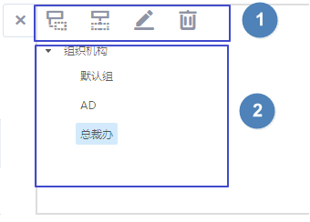

#### 2.3.1界面说明
1.	操作按钮：新建下级，新建同级，编辑，删除。

【新建下级】默认添加所选组织的下级组。

【新建同级】默认添加所选组织的同级组。

【编辑】可编辑组织的基本信息及所属上级组。

【删除】 对组织进行删除操作，仅可单个操作，包含用户和子组的组织不能删除。

2.	组织树：展示用户中心的所有组，有上下级关系。选中任一组左侧用户列表中将展示该组中的所有用户。

3.	用户中心默认提供两个组织：”组织机构“ 和 ”默认组“。

“组织机构”作为用户中心所有组织的根结点存在，不能编辑或删除。只能对“组织机构”进行新建下级组操作。

“默认组”：没有明确分别组织的用户，用户中心会把该用户分配到 “默认组”。不可对“默认组”进行任何操作。自注册用户系统自动分配到“默认组”。

### 2.4扩展属性
为了适应不同应用程序的要求，用户中心最多可以创建 20 个扩展属性。扩展属性创建后不可删除。

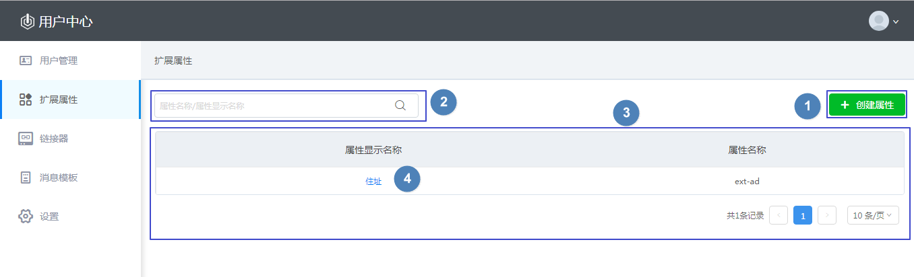

#### 2.4.1界面说明
1. 创建属性：添加扩展属性，最多可添加20条。
2. 搜索：可通过属性名称和属性显示名称快速查找扩展属性。最少需输入2个字符！支持模糊搜索。
3. 属性列表： 展示所有扩展属性。
4. 属性显示名称：单击进入该扩展属性详情页。

### 2.5 连接器
通过连接器，管理员可以配置与LDAP/AD 服务的链接，实现用户同步。同步用户，用户归属于AD/LDAP服务器。

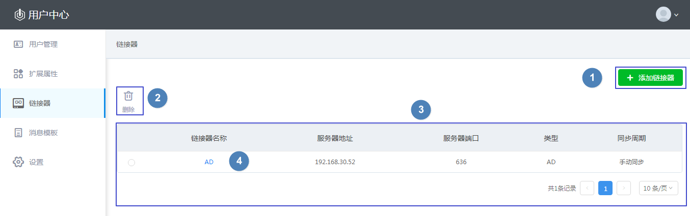

**界面说明**
1. 添加链接器：进入链接器配置页面。管理员可以添加多个链接器。
2. 删除：删除链接器，其同步的用户也一同被删除。
3. 链接器列表：展示所有链接器。
4. 链接器名称：单击进入该链接器详情页。链接器名称会作为父组显示在组织树中。

#### 2.5.1 添加连接器
单击【添加链接器】进入链接器配置页面，如下图：

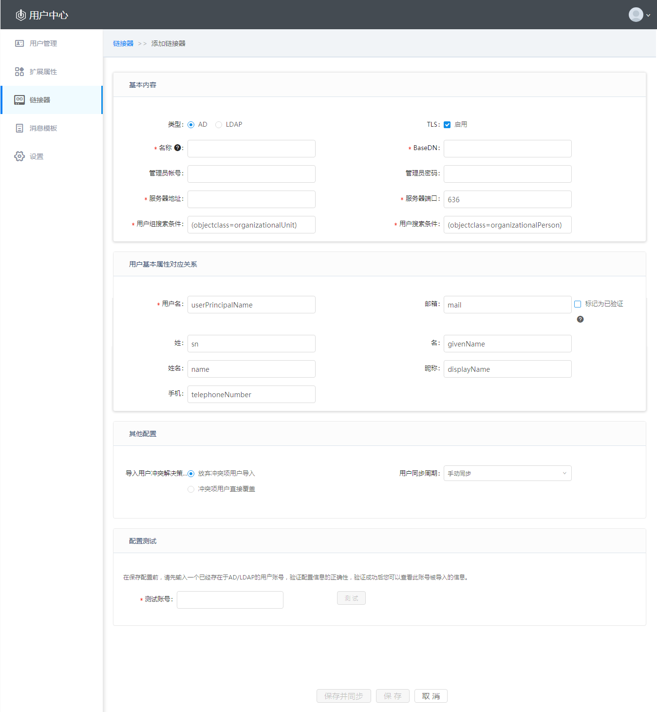

【基本内容】配置将要关联的AD或LDAP服务器的链接信息。

【用户基本属性对应关系】是用户中心中的用户属性与AD/LDAP服务器中用户属性的对应关系。AD和LDAP稍有不同，通过基本内容中的类型进行区分。

【其他配置】主要配置同步用户时的策略。同步用户与用户中心已有用户冲突时，若选择“放弃冲突项用户导入”则仅同步不冲突用户到用户中心。若选择“冲突项用户直接覆盖”则所有用户都同步到用户中心，原用户被替换。用户同步周期可选择手动同步，也可以设置时间范围进行自动同步如12小时，1天，2天，7天。

【配置测试】链接器保存配置前，必需通过输入一个已经存在于AD/LDAP的用户帐号，验证配置信息的正确性。测试成功会显示该帐号的信息，可通过该信息直观的了解同步字段的对应关系。

测试成功显示如下图：

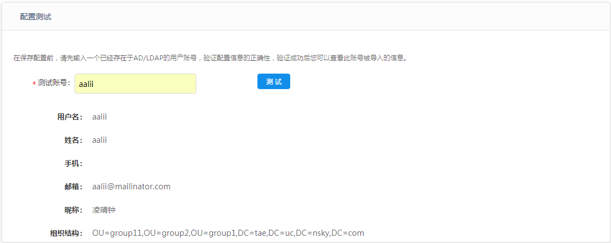

**测试成功后，若再次变更配置内容，需重新测试。**

#### 2.5.2 链接器同步和AD/LDAP导入用户的区别
1. 同步用户需要到AD/LDAP做身份认证。而AD/LDAP导入用户，身份认证由用户中心提供。
2. 同步用户属性是不可以在用户中心中做编辑，用户也不可以移动到其他用户组。导入用户属性是可以被编辑，也可以被移动到其他用户组。
3. 同步用户，用户归属于AD/LDAP。导入用户是一次性的动作，导入后用户归属于UC。
4. 同步用户不能被管理员手动删除 （除非链接器删除后，所有相关用户一同删除）。同步用户密码不能找回。管理员可对导入用户进行所有操作。

### 2.6 设置
可配置系统基本设置，邮件服务器及短信网关。

#### 2.6.1 基本设置
查看用户中心基本信息及初始化配置项。

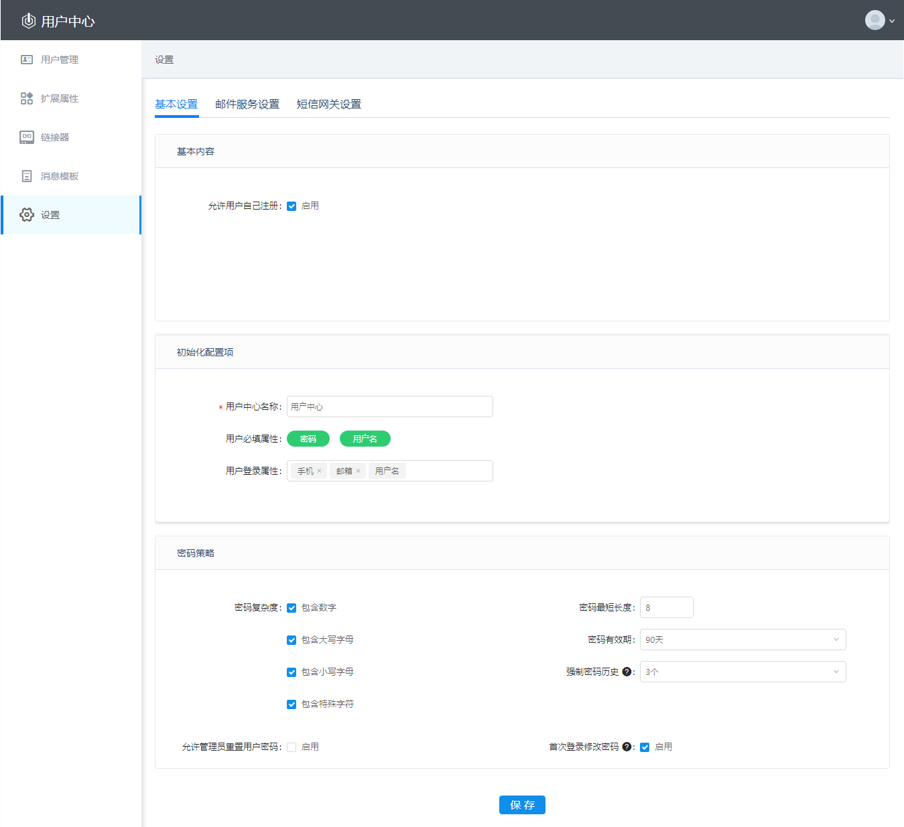

【基本内容】设置是否允许用户自注册。

【初始化配置】设置用户中心名称及登录属性。必填属性不可修改。

【密码策略】可对系统的密码复杂度，长短，有效期，密码历史及是否允许管理员修改密码进行设置。

#### 2.6.2 邮件服务配置
配置您自己的邮件服务地址。配置成功后，用户中心会为新用户发送注册邀请信息。同时，用户忘记密码后，也可以通过验证过的邮箱找回密码。

可直接编辑修改为用户自己的邮件服务地址。

#### 2.6.3 短信网关设置
配置您自己的短信网关。配置成功后，可支持手机登录验证等功能。

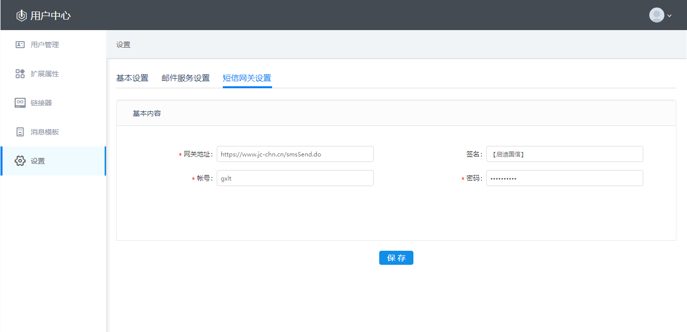

可直接编辑修改为用户自己的短信网关。

### 2.7消息模板
企业可定制自己的邀请邮件，密码重置邮件，验证邮箱邮件和短信内容。

#### 2.7.1 邮件邀请模板
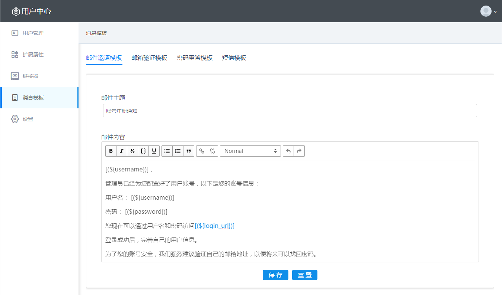

#### 2.7.2 邮箱验证模板
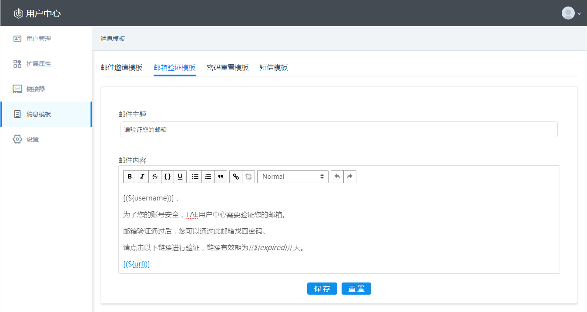

#### 2.7.3 密码重置模板
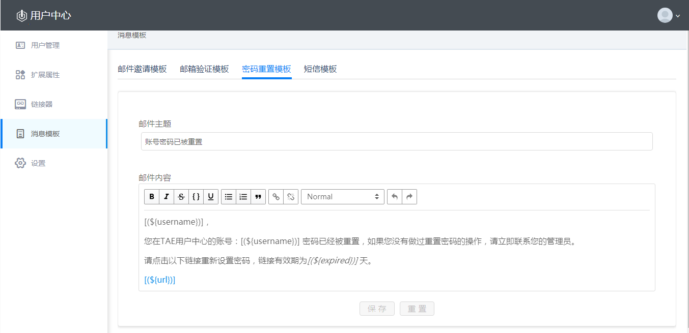

#### 2.7.4 短信模板
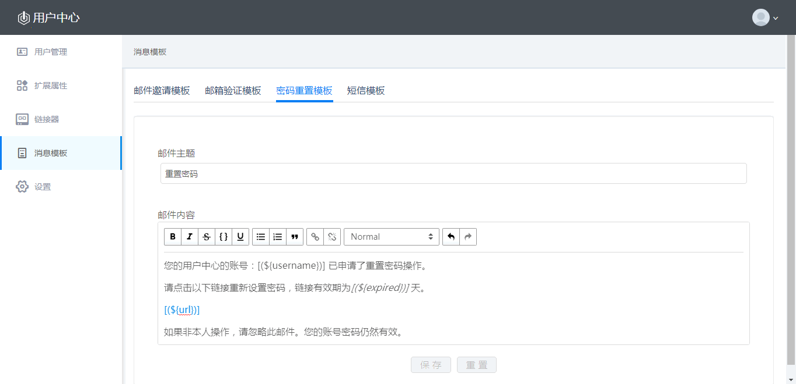
