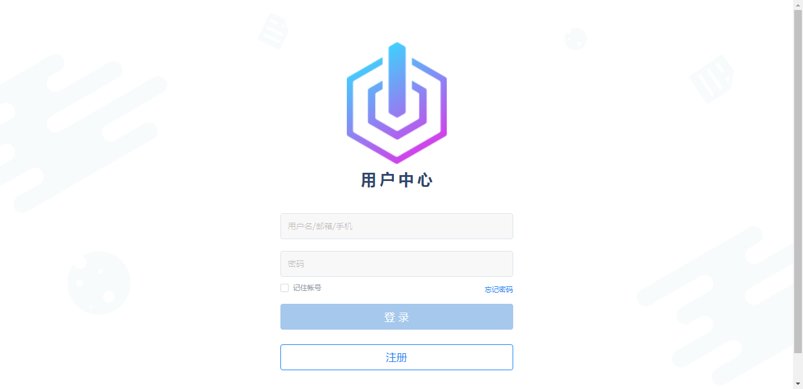
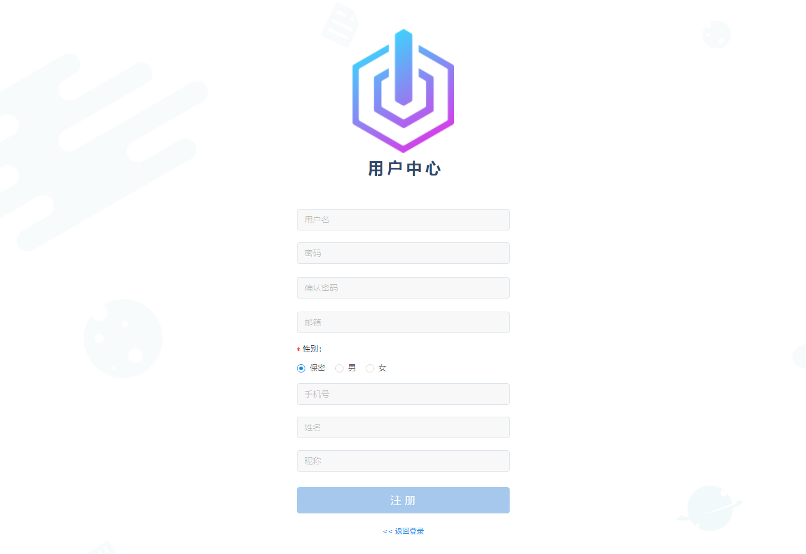
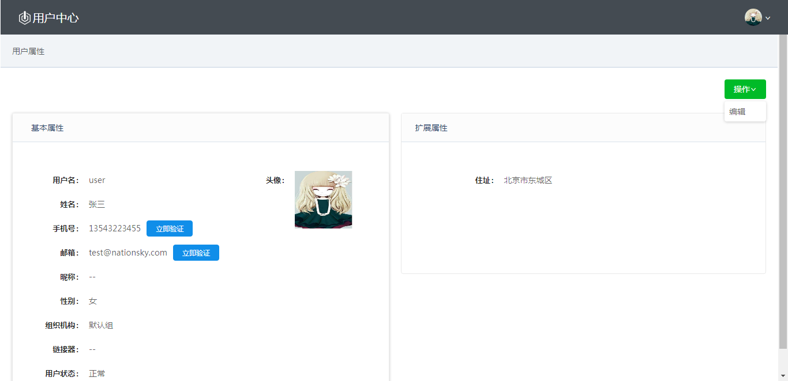
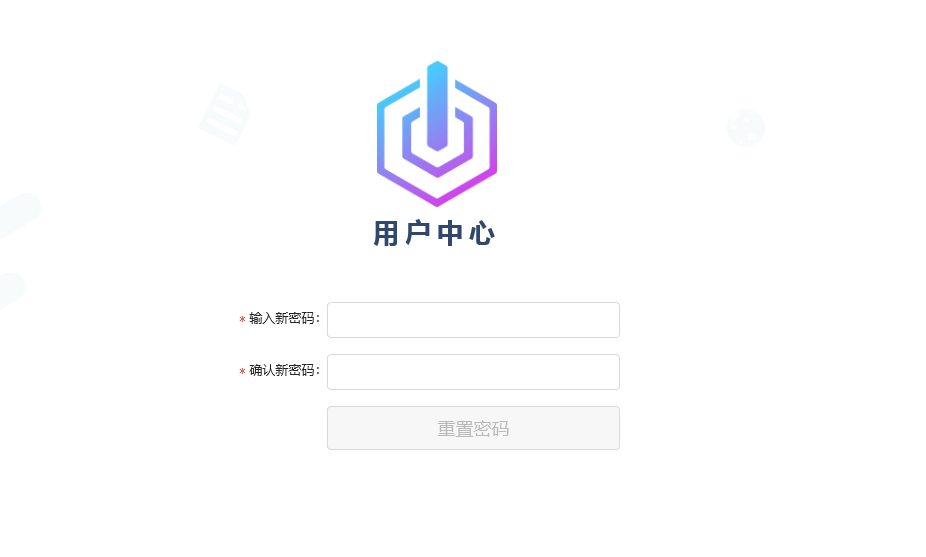

- [UC 3.0 用户使用手册](#start)
    - [1 前言](#intro)
        - [1.1浏览器支持范围](#supported-browsers)
    - [2 用户登录](#ss-login)
        - [2.1 自注册](#ss-reg)
        - [2.2 自服务](#ss)
            - [2.2.1 验证邮箱](#bind-email)
            - [2.2.2 验证手机](#bind-mobile)
            - [2.3 重置密码](#forget-passwd)

# <a name="start"/>UC 3.0 用户使用手册
## <a name="intro"/>1 前言
用户中心为企业提供了统一的用户管理与身份认证服务。用户中心管理平台为管理员提供了用户管理，用户属性管理，用户组织结构管理，密码复杂度等策略配置。管理员可以通过设置链接器同步企业AD/LDAP中的帐号。同时，普通用户也可以登录管理平台查看自己的用户属性。

### <a name="supported-browsers"/>1.1浏览器支持范围
- Internet Explorer 11
- Chrome 43 

## <a name="ss-login"/>2 用户登录

### <a name="ss-reg"/>2.1 自注册
用户中心为了适应不同应用场景，封装了用户自注册功能。自注册功能是新用户可以在用户中心自动创建用户信息的功能，管理员在初始化用户中心时可以开启此功能。 初始化时若允许用户自注册，登录页面中会有注册入口。如图：

单击"注册"跳转到用户自注册页面，如下图：

自注册必填信息与系统初始化所勾选的必填属性一致。

### <a name="ss"/>2.2 自服务
实现用户自服务功能，可查看帐号基本信息及扩展属性信息，并对其进行编辑更新，可修改用户自己的密码。

编辑 ：除用户名和组织机构以外，其他用户信息均可编辑。

点击右上角用户头像图标，用户可修改自己的密码，如图：

#### <a name="bind-email"/>2.2.1 验证邮箱
用户中心建议所有用户都验证自己的邮箱，以便找回密码和收到重要信息通知。

用户登录用户中心后，如果邮箱属性是未验证状态，系统会提示用户验证自己的邮箱。系统会发送一封验证邮件到用户注册的邮箱地址, 邮件内容包含一个URL 链接。用户需要点击此链接验证注册的邮箱地址有效。

当管理员创建用户帐号时，可以通过 “标记为已验证” 选项设置用户邮箱地址为已验证状态。

用户邮箱被验证后会显示为已验证。如果用户更新了邮箱地址，系统会把新的邮箱标记为未验证，用户需要重现验证此邮箱地址。

#### <a name="bind-mobile"/>2.2.2 验证手机
用户可以通过手机找回密码或登录系统。在使用这些功能前，用户必须验证自己的手机有效性。

用户登录用户中心后，如果手机属性是未验证状态，系统会提示用户验证自己的手机。系统会发送一条验证短信到用户注册的手机，信息内容包含一个验证码。用户需要在5分钟内输入收到的验证码并验证手机有效。

当管理员创建用户帐号时，可以通过 “标记为已验证” 选项设置用户手机为已验证状态。

手机被验证后会显示为已验证。如果用户更新了手机，系统会把新的手机标记为未验证，用户需要重现验证此手机号。

### <a name="forget-passwd"/>2.3 重置密码
当用户忘记密码时，可通过登录页面的"忘记密码"功能重置自己的密码。

- 通过用户名找回密码：用户在登录页面输入用户名， 点击忘记密码，  如果邮箱信息存在，默认通过邮箱找回密码; 如果邮箱信息不存在，手机是已验证状态，应该触发手机找回密码流程。如果邮箱和手机都不存在，用户忘记密码无法重置新密码。
  > 说明：邮箱无需是验证状态，只要用户注册有邮箱信息，就触发邮箱找回密码流程。
- 通过邮箱找回密码：用户在登录页面输入邮箱，点击忘记密码。适用于邮箱设置为登录属性。如果用户邮箱已被验证，用户在登录页面输入邮箱后点击忘记密码，应该触发邮箱找回密码流程。系统会发送邮件到用户邮箱，包含一个重置密码链接。用户点击链接后，可以重置密码。
- 通过手机找回密码：用户在登录页面输入手机，点击忘记密码。适用于手机设置为登录属性。如果用户手机已被验证，系统会提示短信验证码已经发送到您的手机，输入验证码并重置密码。 如果验证码正确，密码被重置。如果验证码错误，提示输入的验证码错误。如果重置密码过程中，验证码过期，提示用户验证码过期，请重新重新发送验证码。
- 如果用户在重置密码页面没有提交新密码，原密码仍然有效。

输入新密码及确认密码，单击"重置密码"用户新密码设置成功。
